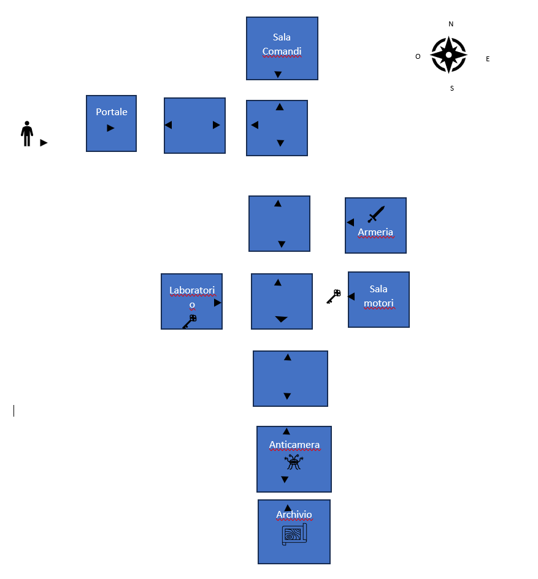

# SPACE ESCAPE
Progetto per l'esame 'Metodi avanzati di programmazione' per l'anno accademico 2023/24.  
Nome gruppo: I SanGiovannesi.  
Autori: Scarale Francescopio, Russo Nicola, Squarcella-Gorgoglione Francesco.

## INDICE

1. [Introduzione](#introduzione)
   - [Mappa di gioco](#mappa-di-gioco)
2. [Utilizzo](#utilizzo)
   - [Comandi principali](#comandi-principali)
3. [Diagrammi UML](#diagrammi-uml)
4. [Specifica algebrica](#specifica-algebrica)
   - [Specifica sintattica](#specifica-sintattica)
   - [Specifica semantica](#specifica-semantica)
   - [Specifica di restrizione](#specifica-di-restrizione)
5. [Contenuti rilevanti](#contenuti-rilevanti)
   - [Utilizzo dei file](#utilizzo-dei-file)
   - [Utilizzo dei database](#Utilizzo-dei-database)
   - [Utilizzo dei thread](#utilizzo-dei-thread)
   - [Swing](#swing)
   - [RESTful](#restful)
6. [Doxygen](#doxygen)
   
## Introduzione
**SPACE ESCAPE** è un'avventura testuale interattiva progettata per l'esame di 'Metodi avanzati di programmazione', sviluppata interamente in linguaggio java. Il gioco si svolge attraverso un'interfaccia grafica (**GUI**), che consente agli utenti interagire con essa e immergersi nell'avventura di una navicella spaziale intrappolata nello spazio. Inoltre il programma supporta il salvataggio e il caricamento di una partita, oltre ad una classifica globale gestita tramite server.

### Descrizione del gioco
L'obiettivo del gioco è scappare dalla navicella spaziale per tornare sani e salvi sulla Terra. Per raggiungere questo obiettivo, i giocatori devono esplorare la mappa di gioco, raccogliere oggetti e codici, e risolvere enigmi. Il gioco inizia con una schermata introduttiva che spiega il contesto e le prime istruzioni per iniziare.

### Come si gioca
Per muoversi all'interno della mappa, il giocatore deve utilizzare i comandi direzionali **nord**, **sud**, **est** e **ovest**. È possibile esplorare le stanze e i corridoi usando il comando **osserva**, che fornisce una descrizione dettagliata dell'ambiente circostante. Inoltre, il giocatore può interagire con oggetti e porte tramite comandi come **utilizza**, **prendi**, **apri**, e altri.

### Mappa di gioco
  
La mappa di gioco mostra tutte le stanze e i corridoi esplorabili. Le freccette nere indicano i possibili movimenti tra le diverse aree. Gli oggetti e gli ostacoli rappresentati nella mappa sono quelli che i giocatori incontreranno durante l'avventura.

## Utilizzo
In **SPACE ESCAPE**, il giocatore assume il ruolo di un astronauta intrappolato su una navicella spaziale alla deriva nello spazio. L'obiettivo è esplorare l'ambiente, risolvere enigmi e raccogliere oggetti necessari per attivare la navicella e tornare sulla Terra.

### Comandi Principali
Per interagire con il gioco, utilizza i seguenti comandi:
 
nord: Spostati a nord. 
sud: Spostati a sud. 
est: Spostati a est. 
ovest: Spostati a ovest. 
osserva: Osserva la stanza attuale per una descrizione dettagliata. 
prendi : Prendi un oggetto. 
usa : Usa un oggetto nell'inventario. 
apri : Apri una un oggetto, se possibile. 
ammazza : Ammazza qualsiasi mostro/alieno esistente. 
inventario : Stampa tutti gli oggetti che il giocatore ha raccolto durante la partita. 
abbandona: Termina il gioco. 
attiva: Attiva i vari pannelli e portali. 
leggi: Legge le varie mappe/cartine. 
Man mano che esplori la navicella, troverai vari oggetti che potrebbero essere utili per risolvere enigmi e superare ostacoli. Usa i comandi sopra elencati per interagire con l'ambiente e avanzare nel gioco.

## Specifica algebrica
### Specifica sintattica
sorts:Dizionario, chiave, valore, Boolean  

operations: 
- newDizionario: () -> Dizionario
- put: Dizionario, chiave, valore -> Dizionario
- get: Dizionario, chiave -> valore
- remove: Dizionario, chiave -> Dizionario
- isEmpty: Dizionario -> Boolean
- containsKey: Dizionario, chiave -> Boolean
- containsValue: Dizionario, valore -> Boolean
- size: Dizionario -> Integer
- keySet: Dizionario -> List<chiave>
- values: Dizionario -> List<valore>
- clear: Dizionario -> Dizionario

### Specifica semantica
declase:d:dizionario, k:chiave, v:valore.  
- isEmpty(newDizionario()) = true
- isEmpty(put(d, k, v)) = false
- get(put(d, k, v), k) = v
- get(d, k) = undefined se containsKey(d, k) = false
- remove(d, k) = d se containsKey(d, k) = false
- containsKey(remove(d, k), k) = false
- containsKey(put(d, k, v), k) = true
- containsValue(d, v) = (∃k | get(d, k) = v)
- size(newDizionario()) = 0
- size(put(d, k, v)) = size(d) + 1 se containsKey(d, k) = false
- size(put(d, k, v)) = size(d) se containsKey(d, k) = true
- size(remove(d, k)) = size(d) - 1 se containsKey(d, k) = true
- size(remove(d, k)) = size(d) se containsKey(d, k) = false
- keySet(d) = { k | containsKey(d, k) }
- values(d) = [ get(d, k) | k ∈ keySet(d) ]
- isEmpty(clear(d)) = true

### Specifica di restrizione
restrictions:
∀ d:Dizionario, k: chiave, v: valore.  
- ∀k' | (k' ≠ k implica get(put(d, k, v), k') = get(d, k'))        
- ∀k' | (k' ≠ k implica get(remove(d, k), k') = get(d, k'))
- keySet(d).contains(k) = containsKey(d, k)
- values(d).contains(v) = containsValue(d, v)        
- ∀k . containsKey(clear(d), k) = false

## Contenuti rilevanti
### Utilizzo dei file
Abbiamo implementato un sistema di salvataggio e caricamento dei dati del gioco utilizzando file di testo per garantire che lo stato del gioco possa essere memorizzato e ripreso in modo efficiente. Il metodo save nella classe SaveGame è responsabile della scrittura dello stato attuale del gioco in un file di salvataggio. Questo metodo accetta vari parametri come la stanza corrente (`currentRoom`), l'inventario del giocatore (`inventory`), il nome del gioco (`gameName`), il tempo trascorso (`elapsedSeconds`), lo stato del mostro (`monsterAlive`) e lo stato della porta (`isDoorOpen`). Prima di procedere con il salvataggio, il metodo verifica se esiste già un salvataggio con lo stesso nome, evitando duplicati. 
I dati vengono scritti nel file in un formato leggibile, con ogni salvataggio separato da una linea delimitatrice `---`. Le informazioni includono dettagli specifici come GameName, ElapsedSeconds, CurrentRoom, MonsterAlive, DoorOpen e l'elenco degli oggetti nell'inventario. Ogni campo viene scritto in una nuova riga per garantire la chiarezza e la facilità di parsing durante il caricamento. 
Per il caricamento, il metodo load legge il file di salvataggio e cerca il gioco con il nome specificato. Una volta trovato, estrae i dati salvati e li memorizza in una mappa (Map<String, Object>), che include tutte le informazioni necessarie per ripristinare lo stato del gioco. Queste informazioni vengono poi utilizzate per impostare lo stato del gioco, inclusa la stanza corrente, lo stato del mostro, lo stato della porta e l'inventario del giocatore.
Quando si carica un salvataggio, il metodo load ripristina lo stato della porta e del mostro utilizzando i dati salvati. Questo assicura che il gioco riprenda dallo stesso punto in cui è stato lasciato, mantenendo la continuità dell'esperienza di gioco. 
In sintesi, il sistema di salvataggio e caricamento utilizza file di testo per memorizzare e ripristinare lo stato del gioco, garantendo che tutte le informazioni cruciali, come lo stato della stanza, l'inventario e lo stato degli oggetti, vengano conservate correttamente tra le sessioni di gioco. Questo approccio permette una gestione semplice ed efficace dello stato del gioco, migliorando l'esperienza del giocatore.

### Utilizzo dei database
Abbiamo deciso di utilizzare due database nel nostro programma: uno per il salvataggio delle informazioni delle stanze e degli oggetti (id, nome, descrizione, descrizione dettagliata e tipo) e uno per salvare le informazioni relative ai giocatori che riescono a concludere il gioco (id, nome, data in cui finisce il gioco e tempo di gioco). 
Nel primo caso la gestione del database è effettuata tramite la classe `Database` inserita nel package `di.uniba.map.b.adventure.impl` del progetto `adventure`. In questa classe effettuiamo la connessione al database nel costruttore e abbiamo dei metodi che ci permettono di modificare o cercare nome, descrizione o descrizione dettagliata (look) all'interno del database inserendo in input l'id (`getNameById`, `getDescriptionById`, `getRoomLookById` e `updateNameById`, `updateDescriptionById`, `updateRoomLookById`) e un metodo per l'inserimento dei dati, che ci fa inserire questi ultimi da riga di comando(`insertNewData`). Il database è stato riempito tramite con il metodo `insertNewData` precedentemente. 
Nel secondo caso invece il database viene gestito con la classe `Database` inserita nel package `com.mycompany.restserver` all'interno del progetto `Restserver`. Anche in questo caso la connessione viene effettuata all'interno del costruttore, poi abbiamo dei metodi per l'inserimento dei dati (`insertInLeaderboard`), la restituzione delle info di un giocatore ricevendo in input l'id (`getFromLeaderboard`) e la restituzione dei migliori giocatori ricevendo in input il numero di giocatori che si vuole avere (`getTopPlayers`). 
In entrambi i casi abbiamo utilizzato Database `Engine H2` poiché possono essere utilizzati in modo embedded senza necessità di installare un server.

### Utilizzo dei thread
La classe AePlayWave è progettata per riprodurre file audio WAV in un thread separato, permettendo così operazioni asincrone come la riproduzione, l'interruzione e la gestione del pan audio (sinistra, destra, normale). Questa classe fa parte del package di.uniba.map.b.adventure.impl e gestisce la riproduzione del suono utilizzando la libreria javax.sound.sampled. 
Nella classe sono stati inseriti diversi metodi così da gestire al meglio il thread:
- stopSound(): Metodo che imposta il flag isInterrupted a true e interrompe il thread corrente chiamando interrupt(). Questo metodo permette di fermare la riproduzione del suono in qualsiasi momento.
- startSound(): Metodo che avvia o riprende la riproduzione del suono. Se il suono non è attualmente in riproduzione (!isPlaying), reimposta isInterrupted a false e avvia il thread chiamando start(), il quale a sua volta esegue il metodo run().
- run(): Metodo che sovrascrive il metodo run della classe Thread e contiene la logica per la riproduzione del file audio. La riproduzione continua finché isInterrupted è false. All'interno del metodo, viene aperto il file audio e letto in un buffer che viene poi scritto su un SourceDataLine per la riproduzione. Se il controllo del pan è supportato, viene regolato in base alla posizione corrente (sinistra, destra, normale).

I thread vengono utilizzati per eseguire la riproduzione del suono in parallelo rispetto al thread principale dell'applicazione. Questo permette all'utente di eseguire altre operazioni mentre l'audio è in riproduzione, senza bloccare l'interfaccia utente o altre funzionalità dell'applicazione. 
Quando si chiama startSound(), il thread viene avviato utilizzando il metodo start(), che a sua volta invoca il metodo run() del thread. Questo metodo contiene il loop principale di riproduzione del suono. Durante la riproduzione, il thread legge i dati dal file audio e li scrive nel buffer del SourceDataLine per la riproduzione. 
Quando si chiama stopSound(), il flag isInterrupted viene impostato a true e il thread corrente viene interrotto utilizzando interrupt(). Questo provoca l'uscita dal loop principale nel metodo run() e consente la pulizia delle risorse, come la chiusura del SourceDataLine e dell'AudioInputStream.  
Vantaggi dell'uso dei Thread:
- Asincronia: La riproduzione del suono avviene in modo asincrono, permettendo all'applicazione principale di continuare a funzionare senza blocchi.
- Reattività: L'interfaccia utente rimane reattiva, poiché la riproduzione audio non blocca il thread principale.
- Controllo: È possibile interrompere la riproduzione del suono in qualsiasi momento senza dover aspettare che il file audio termini.
La classe AePlayWave dimostra come i thread possono essere utilizzati per eseguire operazioni che richiedono tempo, come la riproduzione di file audio, in modo efficiente e senza compromettere l'esperienza dell'utente..

### Swing
Nel progetto abbiamo utilizzato la libreria grafica Swing per garantire al giocatore un'esperienza più immersiva. 
Lo sfondo del gioco varia a seconda di cosa si sta facendo, di fatti si parte con un'immagine nella schermata iniziale, quella in cui si introduce il gioco, poi una volta iniziato a giocare l'immagine di sfondo varia a seconda della stanza in cui ci si trova. Le immagini sono state create da vari software generativi. 
Nella finestra che viene creata oltre alle immagini di sfondo sono stati aggiunti vari componenti di interfaccia frafica:
- Caselle di testo per prendere in input i comandi del giocatore.
- Arree di testo per far visualizzare:
   - I nomi delle stanze
   - La descrizione delle stanze
   - I Messaggi del gioco
   - La classifica
   - Il tempo di gioco
- Tasti per permettere al giocatore di svolgere diverse operazioni:
   - Iniziare una nuova partita
   - Caricare una partita salvata
   - Visualizzare la classifica
   - Nascondere la clasifica
   - Mettere in pausa il gioco
   - Uscire dal gioco senza salvare la partita
   - Uscire dal gioco salvando la partita
 
### RESTful
Questo progetto utilizza un'architettura RESTful per gestire una classifica di un gioco, composta da un client REST, un server REST e un servizio RESTful. Questi componenti lavorano insieme per consentire l'aggiunta di dati dei giocatori alla classifica e il recupero delle posizioni attuali della classifica.
#### RESTClient
La classe `RESTClient` è progettata per interagire con il servizio RESTful. Utilizza l'API JAX-RS per inviare richieste HTTP al server e la libreria Gson per la serializzazione e deserializzazione dei dati JSON. Il costruttore della classe inizializza il client REST, imposta l'URL di destinazione del servizio e il parser JSON. La classe `RESTClient` ha due metodi principali:
- **addPlayer(PlayerData player)**: Questo metodo invia una richiesta PUT al server per aggiungere i dati di un nuovo giocatore alla classifica. I dati del giocatore vengono convertiti in formato JSON e inviati al server. La risposta del server viene quindi stampata sulla console per la verifica.
- **getLeaderboard()**: Questo metodo invia una richiesta GET al server per ottenere la classifica attuale. La risposta JSON viene deserializzata in una lista di oggetti, che vengono poi formattati in una stringa leggibile che rappresenta la classifica e restituita.
#### RESTServer
La classe `RESTServer` avvia il server HTTP utilizzando la libreria Grizzly. Configura il server per ascoltare le richieste sulla porta 4321 e mappa le richieste al servizio `LeaderboardService`. Il metodo `startServer()` configura e avvia il server, aggiungendo anche un hook di spegnimento per garantire che il server si chiuda correttamente quando l'applicazione termina. Il server viene avviato nel metodo `main`, che è il punto di ingresso dell'applicazione.
#### LeaderboardService
La classe `LeaderboardService` è il cuore del servizio RESTful che gestisce le richieste relative alla classifica. Utilizza le annotazioni JAX-RS per mappare le richieste HTTP ai metodi Java e interagisce con un database per recuperare e inserire i dati dei giocatori. Questa classe contiene due metodi principali:
- **getLeaderboard()**: Questo metodo gestisce le richieste GET per recuperare le prime posizioni della classifica. Quando viene ricevuta una richiesta GET, il metodo interroga il database per ottenere i migliori giocatori, converte i dati in formato JSON e li restituisce al client come risposta. In caso di errore, restituisce un messaggio di errore adeguato.
- **addPlayer(String json)**: Questo metodo gestisce le richieste PUT per aggiungere un nuovo giocatore alla classifica. Riceve i dati del giocatore in formato JSON, li deserializza in un oggetto `PlayerData` e inserisce i dati nel database. Se l'operazione ha successo, restituisce una risposta di conferma; altrimenti, restituisce un messaggio di errore.

#### Interazione tra i Componenti
1. **Aggiunta di un Giocatore**: Il client (`RESTClient`) invia una richiesta PUT al server per aggiungere un nuovo giocatore alla classifica. La richiesta è gestita dal servizio (`LeaderboardService`), che inserisce i dati nel database e restituisce una risposta al client.
2. **Recupero della Classifica**: Il client invia una richiesta GET al server per ottenere la classifica attuale. Il servizio (`LeaderboardService`) recupera i dati dal database, li converte in formato JSON e li restituisce al client, che li deserializza e formatta in una stringa leggibile.
Questa architettura separa chiaramente le responsabilità tra client, server e logica di business, facilitando la manutenzione e l'estensione dell'applicazione. Il client REST è responsabile dell'invio delle richieste e della gestione delle risposte, il server REST gestisce le connessioni HTTP e il servizio RESTful contiene la logica di business per l'elaborazione delle richieste relative alla classifica.

## Doxygen
Per visualizzare la documentazione doxygen aprire il collegamento "index" inserito nella cartella "progetto-map".

