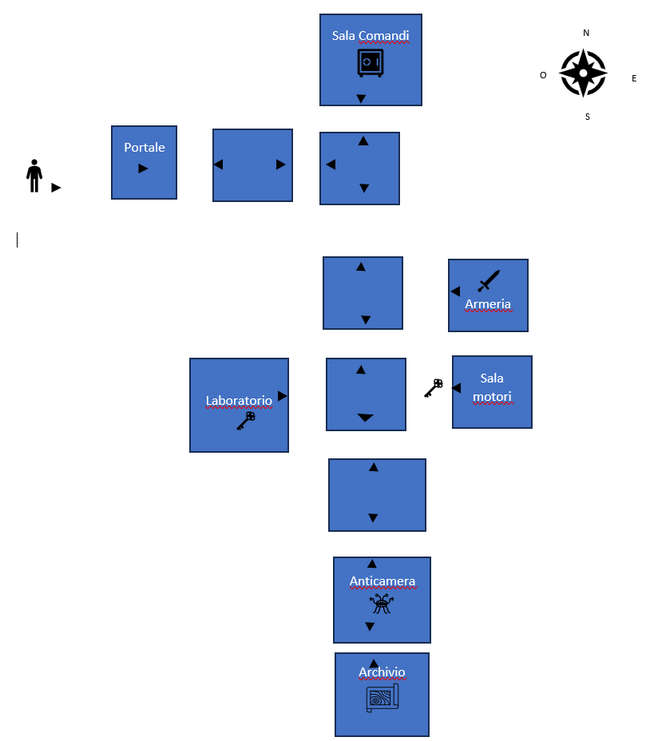

# SPACE ESCAPE
Progetto per l'esame 'Metodi avanzati di programmazione' per l'anno accademico 2023/24.  
Nome gruppo: I SanGiovannesi.  
Autori: Scarale Francescopio, Russo Nicola, Squarcella-Gorgoglione Francesco.

## INDICE

1. [Introduzione](#introduzione)
   - [Mappa di gioco](#mappa-di-gioco)
2. [Utilizzo](#utilizzo)
   - [Comandi principali](#comandi-principali)
3. [Diagrammi UML](#diagrammi-uml)
4. [Specifica algebrica](#specifica-algebrica)
   - [Specifica sintattica](#specifica-sintattica)
   - [Specifica semantica](#specifica-semantica)
   - [Specifica di restrizione](#specifica-di-restrizione)
5. [Contenuti rilevanti](#contenuti-rilevanti)
   - [Utilizzo dei file](#utilizzo-dei-file)
   - [Utilizzo dei database](#Utilizzo-dei-database)
   
## Introduzione
**SPACE ESCAPE** è un'avventura testuale interattiva progettata per l'esame di 'Metodi avanzati di programmazione', sviluppata interamente in linguaggio java. Il gioco si svolge attraverso un'interfaccia grafica (**GUI**), che consente agli utenti interagire con essa e immergersi nell'avventura di una navicella spaziale intrappolata nello spazio. Inoltre il programma supporta il salvataggio e il caricamento di una partita, oltre ad una classifica globale gestita tramite server.

### Descrizione del gioco
L'obiettivo del gioco è scappare dalla navicella spaziale per tornare sani e salvi sulla Terra. Per raggiungere questo obiettivo, i giocatori devono esplorare la mappa di gioco, raccogliere oggetti e codici, e risolvere enigmi. Il gioco inizia con una schermata introduttiva che spiega il contesto e le prime istruzioni per iniziare.

### Come si gioca
Per muoversi all'interno della mappa, il giocatore deve utilizzare i comandi direzionali **nord**, **sud**, **est** e **ovest**. È possibile esplorare le stanze e i corridoi usando il comando **osserva**, che fornisce una descrizione dettagliata dell'ambiente circostante. Inoltre, il giocatore può interagire con oggetti e porte tramite comandi come **utilizza**, **prendi**, **apri**, e altri.

### Mappa di gioco
  
La mappa di gioco mostra tutte le stanze e i corridoi esplorabili. Le freccette nere indicano i possibili movimenti tra le diverse aree. Gli oggetti e gli ostacoli rappresentati nella mappa sono quelli che i giocatori incontreranno durante l'avventura.

## Utilizzo
In **SPACE ESCAPE**, il giocatore assume il ruolo di un astronauta intrappolato su una navicella spaziale alla deriva nello spazio. L'obiettivo è esplorare l'ambiente, risolvere enigmi e raccogliere oggetti necessari per attivare la navicella e tornare sulla Terra.

### Comandi Principali
Per interagire con il gioco, utilizza i seguenti comandi:
 
nord: Spostati a nord. 
sud: Spostati a sud. 
est: Spostati a est. 
ovest: Spostati a ovest. 
osserva: Osserva la stanza attuale per una descrizione dettagliata. 
prendi : Prendi un oggetto. 
usa : Usa un oggetto nell'inventario. 
apri : Apri una un oggetto, se possibile. 
ammazza : Ammazza qualsiasi mostro/alieno esistente. 
inventario : Stampa tutti gli oggetti che il giocatore ha raccolto durante la partita. 
abbandona: Termina il gioco. 
attiva: Attiva i vari pannelli e portali. 
leggi: Legge le varie mappe/cartine. 
Man mano che esplori la navicella, troverai vari oggetti che potrebbero essere utili per risolvere enigmi e superare ostacoli. Usa i comandi sopra elencati per interagire con l'ambiente e avanzare nel gioco.

## Specifica algebrica
### Specifica sintattica
sorts:Dizionario, chiave, valore, Boolean  

operations: 
- newDizionario: () -> Dizionario
- put: Dizionario, chiave, valore -> Dizionario
- get: Dizionario, chiave -> valore
- remove: Dizionario, chiave -> Dizionario
- isEmpty: Dizionario -> Boolean
- containsKey: Dizionario, chiave -> Boolean
- containsValue: Dizionario, valore -> Boolean
- size: Dizionario -> Integer
- keySet: Dizionario -> List<chiave>
- values: Dizionario -> List<valore>
- clear: Dizionario -> Dizionario

### Specifica semantica
declase:d:dizionario, k:chiave, v:valore.  
- isEmpty(newDizionario()) = true
- isEmpty(put(d, k, v)) = false
- get(put(d, k, v), k) = v
- get(d, k) = undefined se containsKey(d, k) = false
- remove(d, k) = d se containsKey(d, k) = false
- containsKey(remove(d, k), k) = false
- containsKey(put(d, k, v), k) = true
- containsValue(d, v) = (∃k | get(d, k) = v)
- size(newDizionario()) = 0
- size(put(d, k, v)) = size(d) + 1 se containsKey(d, k) = false
- size(put(d, k, v)) = size(d) se containsKey(d, k) = true
- size(remove(d, k)) = size(d) - 1 se containsKey(d, k) = true
- size(remove(d, k)) = size(d) se containsKey(d, k) = false
- keySet(d) = { k | containsKey(d, k) }
- values(d) = [ get(d, k) | k ∈ keySet(d) ]
- isEmpty(clear(d)) = true

### Specifica di restrizione
restrictions:
∀ d:Dizionario, k: chiave, v: valore.  
- ∀k' | (k' ≠ k implica get(put(d, k, v), k') = get(d, k'))        
- ∀k' | (k' ≠ k implica get(remove(d, k), k') = get(d, k'))
- keySet(d).contains(k) = containsKey(d, k)
- values(d).contains(v) = containsValue(d, v)        
- ∀k . containsKey(clear(d), k) = false

## Contenuti rilevanti
### Utilizzo dei file
Abbiamo implementato un sistema di salvataggio e caricamento dei dati del gioco utilizzando file di testo per garantire che lo stato del gioco possa essere memorizzato e ripreso in modo efficiente. Il metodo save nella classe SaveGame è responsabile della scrittura dello stato attuale del gioco in un file di salvataggio. Questo metodo accetta vari parametri come la stanza corrente (currentRoom), l'inventario del giocatore (inventory), il nome del gioco (gameName), il tempo trascorso (elapsedSeconds), lo stato del mostro (monsterAlive) e lo stato della porta (doorOpen). Prima di procedere con il salvataggio, il metodo verifica se esiste già un salvataggio con lo stesso nome, evitando duplicati. 
I dati vengono scritti nel file in un formato leggibile, con ogni salvataggio separato da una linea delimitatrice "---". Le informazioni includono dettagli specifici come GameName, ElapsedSeconds, CurrentRoom, MonsterAlive, DoorOpen e l'elenco degli oggetti nell'inventario. Ogni campo viene scritto in una nuova riga per garantire la chiarezza e la facilità di parsing durante il caricamento. 
Per il caricamento, il metodo load legge il file di salvataggio e cerca il gioco con il nome specificato. Una volta trovato, estrae i dati salvati e li memorizza in una mappa (Map<String, Object>), che include tutte le informazioni necessarie per ripristinare lo stato del gioco. Queste informazioni vengono poi utilizzate per impostare lo stato del gioco, inclusa la stanza corrente, lo stato del mostro, lo stato della porta e l'inventario del giocatore.
Quando si carica un salvataggio, il metodo load ripristina lo stato della porta e del mostro utilizzando i dati salvati. Questo assicura che il gioco riprenda dallo stesso punto in cui è stato lasciato, mantenendo la continuità dell'esperienza di gioco. 
In sintesi, il sistema di salvataggio e caricamento utilizza file di testo per memorizzare e ripristinare lo stato del gioco, garantendo che tutte le informazioni cruciali, come lo stato della stanza, l'inventario e lo stato degli oggetti, vengano conservate correttamente tra le sessioni di gioco. Questo approccio permette una gestione semplice ed efficace dello stato del gioco, migliorando l'esperienza del giocatore.

### Utilizzo dei database
Abbiamo deciso di utilizzare due database nel nostro programma: uno per il salvataggio delle informazioni delle stanze e degli oggetti (id, nome, descrizione, descrizione dettagliata e tipo) e uno per salvare le informazioni relative ai giocatori che riescono a concludere il gioco (id, nome, data in cui finisce il gioco e tempo di gioco). 
Nel primo caso la gestione del database è effettuata tramite la classe "Database" inserita nel package "di.uniba.map.b.adventure.impl" del progetto "adventure". In questa classe effettuiamo la connessione al database nel costruttore e abbiamo dei metodi che ci permettono di modificare o cercare nome, descrizione o descrizione dettagliata (look) all'interno del database inserendo in input l'id (getNameById, getDescriptionById, getRoomLookById e updateNameById, updateDescriptionById, updateRoomLookById) e un metodo per l'inserimento dei dati, che ci fa inserire questi ultimi da riga di comando(insertNewData). Il database è stato riempito tramite con il metodo "insertNewData" precedentemente. 
Nel secondo caso invece il database viene gestito con la classe "Database" inserita nel package "com.mycompany.restserver" all'interno del progetto "Restserver". Anche in questo caso la connessione viene effettuata all'interno del costruttore, poi abbiamo dei metodi per l'inserimento dei dati (insertInLeaderboard), la restituzione delle info di un giocatore ricevendo in input l'id (getFromLeaderboard) e la restituzione dei migliori giocatori ricevendo in input il numero di giocatori che si vuole avere (getTopPlayers). 
In entrambi i casi abbiamo utilizzato Database Engine H2 poiché possono essere utilizzati in modo embedded senza necessità di installare un server.

